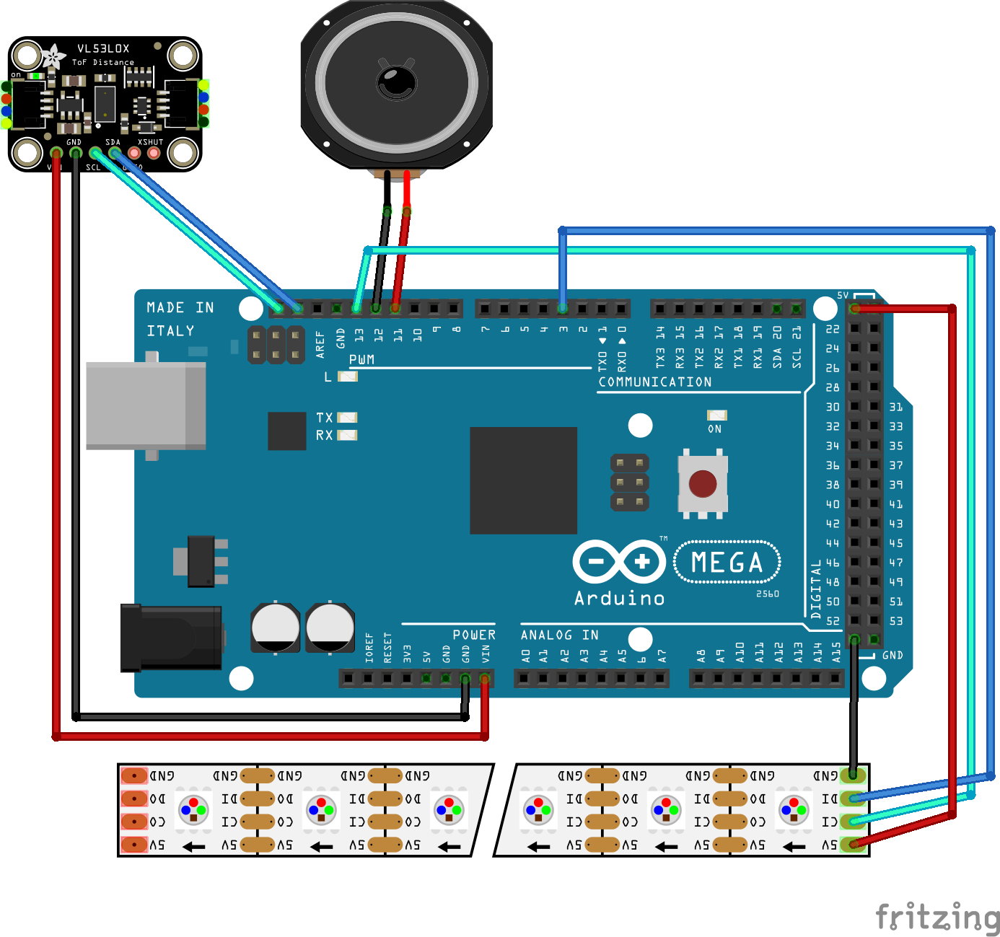

# TOFANG (ToF TWANG)

1D-dungeon-crawler using a distance sensor as input.

## Software

Based on https://github.com/bdring/TWANG, based on https://github.com/Critters/TWANG.

Notable changes:
- the ToF input device -> https://github.com/stm32duino/VL53L4CD
- play by itself in idle mode
- clearer animations for spawners
- tweaked animations for faster plays

This is a https://platformio.org/ build.

## Hardware

- [Arduino Mega 2560 Rev3](https://store.arduino.cc/products/arduino-mega-2560-rev3=)
- [VL53L4CD ToF Sensor](https://www.adafruit.com/product/5396), [datasheet](https://cdn.sparkfun.com/assets/d/b/b/7/c/vl53l4cd.pdf)
- APA102 LED Stripe
- any small speaker
- power supply (5V, ~5A)

